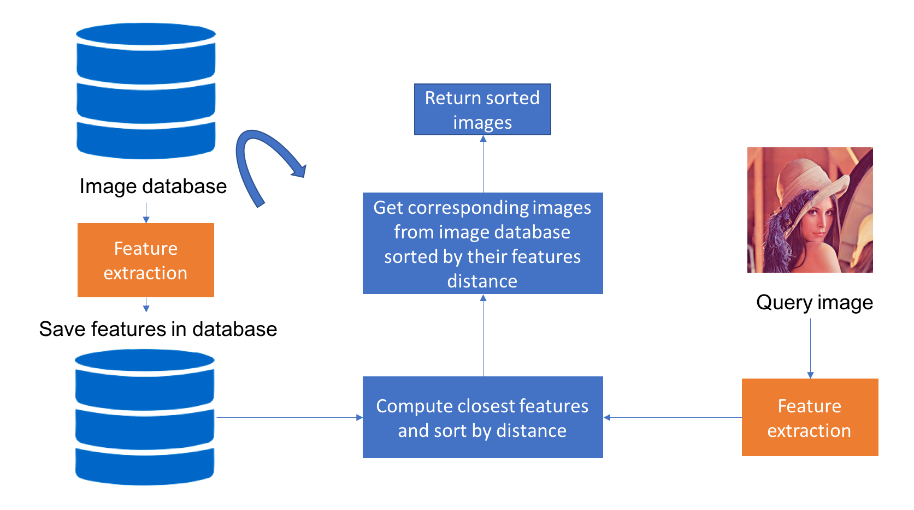

# Product classification
**[Vision AI 경진대회(채용연계)](https://megaproduct.lotte.net/competitionSummary/6)**
- resource : 2080ti
- 주최/주관 : 롯데정보통신


# Solution


- 문제 정의

    총 120000개의 이미지를 1000개 상품 종류로 분류하는 작업

- 데이터 셋

    train data 48000장 (1000 클래스 * 48개 = 48000)

    test data 72000장 (1000 클래스 * 72개 = 72000)

    (sample image를 업로드 하고 싶지만 데이터 저작권에 위배되는 사항이라 업로드하지 못한점 양해부탁드립니다.)

1. 문제 정의를 보았을 때 단순히 classification 문제로 풀면 될 것 같아 보여 pre-trained cnn model을 이용하여 cross entropy로 classification 진행
2. validation score가 높게 나와 쉽지않게 해결을 할 수 있을 것이라고 생각했지만 submit 결과가 75점으로 좋지 않음
3. overfit이나 train dataset과 test dataset이 다를 것이라고 예상
4. test 데이터 확인 결과 train에서는 보지 못하는 데이터들이 많음
5. overfit 보다는 데이터 셋의 차이가 심하다고 판단
6. 추가로 class 별 데이터 갯수가 48개로 매우 작음
7. class 별로 특징(feature)를 추출하기 어려움이 있음

위 과정으로 새롭게 정의된 문제는 두 가지로 

1. **train dataset과 test dataset이 상이함**
2. **class 별 데이터가 매우 작음** 

 

새롭게 정의한 문제들은 단순한 image classification으로는 한계가 있다고 판단하였고 위 특징을 갖고 있는 이미지 검색(image retrieval)문제로 재해석하여 model architecture를 새롭게 구성하게 되었습니다.


(figure 1. image retrieval) 
[reference link](https://medium.com/sicara/keras-tutorial-content-based-image-retrieval-convolutional-denoising-autoencoder-dc91450cc511)

최근 review 했던 kaggle의 [Google Landmark Recognition 2020](https://www.kaggle.com/c/landmark-recognition-2020/rules)와 dacon [랜드마크 분류 AI 경진대회](https://dacon.io/competitions/official/235585/overview/description/)를 참고하여 작업을 진행하였습니다.

- backbone network
    - Efficientnet b1 ns
    - NFnet b0
- pooling layer
    - GeM(Generalized mean) pooling layer

        
        
        (figure 2. GeM)

- Optimizer
    - SGD
- learning rate scheduler
    - warmup + CosineAnnealingLR
- Loss
    - ArcFaceLoss
- Embedding size
    - 512
- Inference
    - TTA(Test Time Augmentation)
        - TTA 횟수 : 1
        - Horizontal flip augmentation
    - 5 fold cross validation
        - Efficientnet 5fold + NfNet 5fold
        - 10개 모델을 이용하여 **train/test dataset** **feature extract**
        - feature L2 Normalize
        - **train/test feature similarity** 계산

# train
To train a model, please run src/run.py with a config file as flag:
```
python run.py -C conf_1_nf0
python run.py -C conf_2_nf0
python run.py -C conf_3_nf0
python run.py -C conf_4_nf0
python run.py -C conf_5_nf0

python run.py -C conf_1
python run.py -C conf_2
python run.py -C conf_3
python run.py -C conf_4
python run.py -C conf_5

```

# inference
model weight file download [[link]](https://drive.google.com/drive/folders/1OMYSN8Za9URVVYeqoUKqq82ti6hpkinj?usp=sharing)
```
~/notebook/infer.ipynb
```


### reference
https://github.com/hyeonho1028/landmark-classification \
https://www.kaggle.com/c/landmark-recognition-2020 \
https://www.kaggle.com/c/landmark-recognition-2020/discussion/187821 \
https://www.kaggle.com/c/landmark-recognition-2020/discussion/190983
